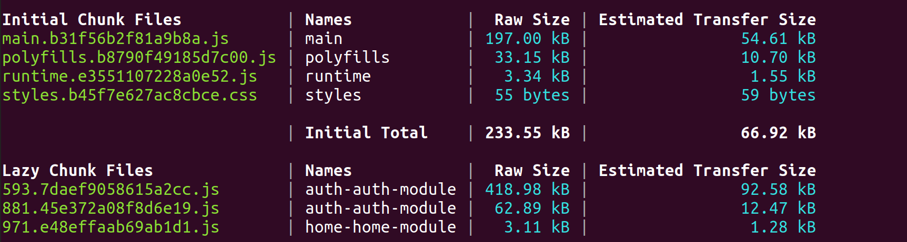
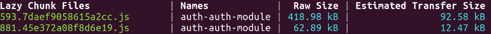
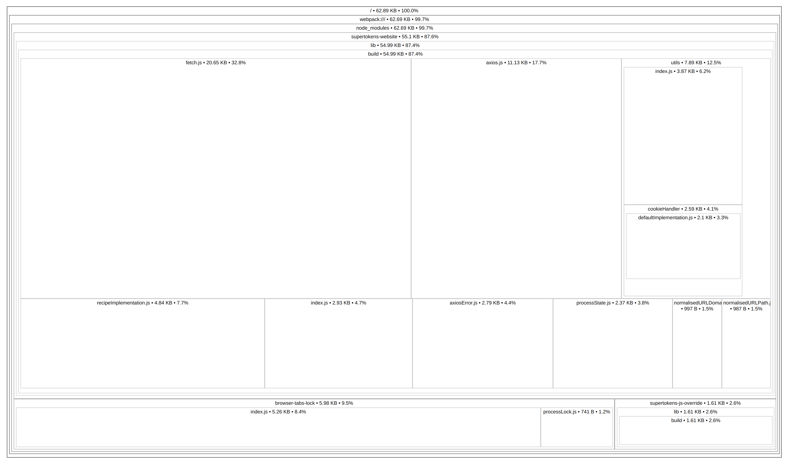
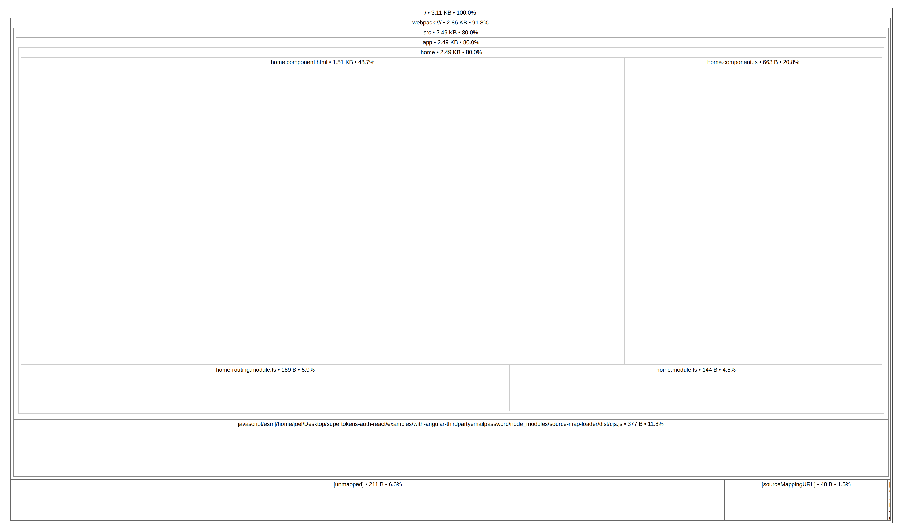
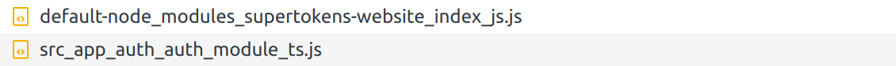
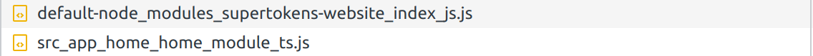

# SuperTokens ThirdpartyEmailPassword demo app with Angular and React

This demo app demonstrates the following use cases:

-   Login / sign up with SuperTokens
-   Logout
-   Forgot password flow
-   Session management

In this demo, whenver we visit an auth related route (`/auth/*` in this case), we will load a React component which will initialize SuperTokens and handle the authentication flow. All other routes will use Angular Components.

This project was generated with [Angular CLI](https://github.com/angular/angular-cli) version 13.3.6.

## Project setup

Use `npm` to install the project dependencies:

```bash
npm install
```

## Run the demo app

This compiles and serves the Angular App on port `4200` and starts up a server on port `3001`

```bash
npm run start
```

The app will start on `http://localhost:4200`

## Project structure & Parameters

-   The frontend code is located in the `/src` folder.
-   The backend API is in the `server.ts` file.

## Code splitting and bundle analysis

This example project uses 3 Angular components:

-   A `root` component which contains the routing for our `auth` and `home` components.
-   A `home` component which uses SuperTokens `supertokens-website` SDK for session management.
-   An `auth` component which uses SuperTokens `supertokens-auth-react` SDK to handle Authentication flows and Login UI

To enable code splitting, we will not be directly importing our home and auth components in the root component, but the routing in the root component will use references to the home and auth component modules. This will tell Angular to create separate bundles for the auth and home components during the build process.

This will decrease the main bundle size and allow us to lazy-load the home and auth component chunks depending on which route we visit.

### Bundle analysis

If we take a look at the output of the build we will see the following:



The files we are interested in are the main bundle and the lazy chunk files.

We can use Angular's source map explorer to take a look at the contents of these files

#### Main bundle

Using the source map explorer the main bundle will result in the following output


We can see that the main bundle does not contain the home and auth components and their dependencies. This makes sense since those components are now bundles separately.

#### Auth bundles

If we take a look at the build output we can see that there are two bundles related to the auth module.



To understand why this is the case we need to take a look at the source maps of the two chunks

Chunk 1


-   We can see that most of size of the first bundle is occupied by the `supertokens-auth-react`, its dependencies and `react-dom`.

Chunk 2



-   Most of size of the second bundle is occupied by the `supertokens-website`.

-   It makes sense that the `supertokens-website` package is in the auth bundle since `supertokens-auth-react` has a dependency on `supertokens-website`, but the question which arises is **Why is it bundled separately?**

To answer this question we will need to take a look at the home bundle.

#### Home bundle

The source map for the home bundle will have the following output:



-   We can see the source map does not contain the `supertokens-website` SDK even though it is used in the home component.

-   So lets answer the previously raised question. Since both the `home` component and the `auth` component have dependencies on `supertokens-website`, Angular will bundle the libary into its own chunk which will be served for both the home and auth related routes. This is done to prevent duplication of the `supertokens-website` library in both bundles.

We can actually see this behavior by looking at the network traffic when visiting the routes

## Analyzing Network traffic for routes

When visiting the auth component related route:



-   We can see the `supertokens-website` related chunk and the `auth` bundle containing `supertokens-auth-react` being retrieved.

When visiting the home component related route:



-   We can see the `supertokens-website` related chunk and the `home` bundle being retrieved

## Author

Created with :heart: by the folks at supertokens.com.
