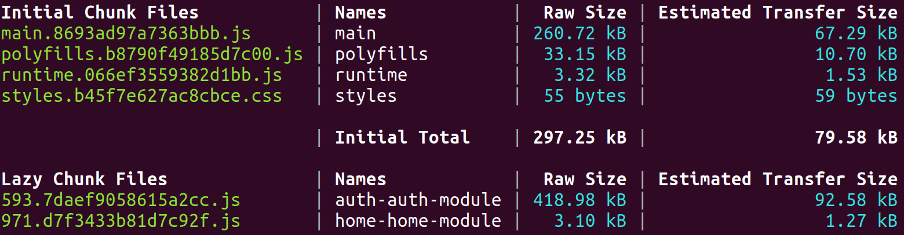
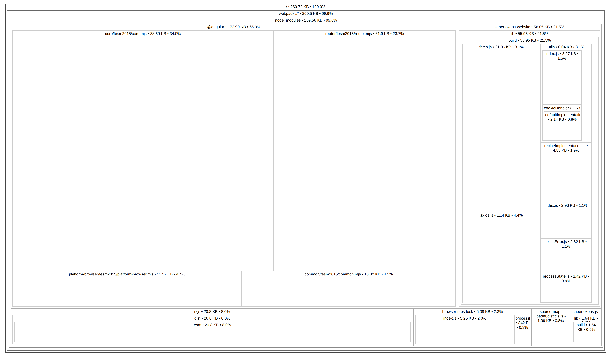
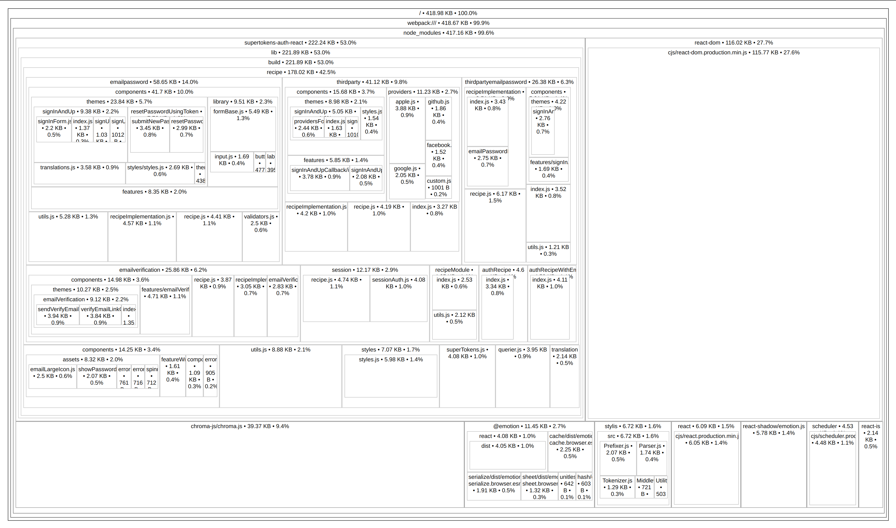
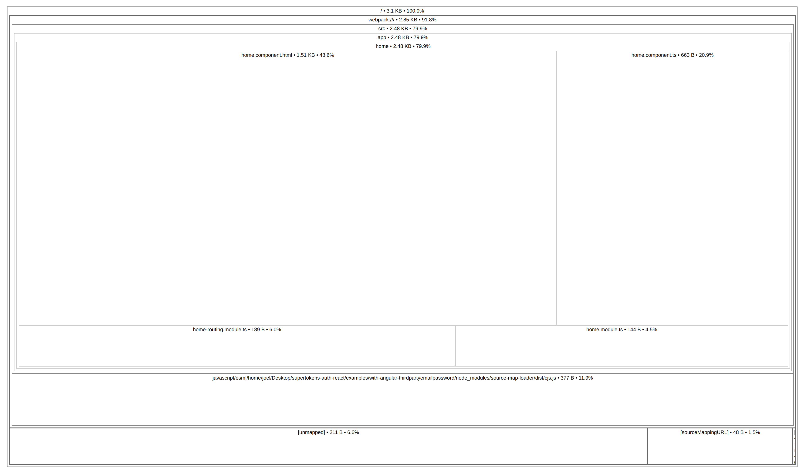

# SuperTokens ThirdpartyEmailPassword demo app with Angular and React

This demo app demonstrates the following use cases:

-   Login / sign up with SuperTokens
-   Logout
-   Forgot password flow
-   Session management

In this demo, whenver we visit an auth related route (`/auth/*` in this case), we will load a React component which will initialize SuperTokens and handle the authentication flow. All other routes will use Angular Components.

In this demo, when our root component loads we will initialize the `supertokens-website` SDK which will be used by our other components for session management. When we visit an auth related route (`/auth/*` in this case), we will load a React component which will initialize the `supertokens-auth-react` SDK and handle the authentication flow.

This project was generated with [Angular CLI](https://github.com/angular/angular-cli) version 13.3.6.

## Project setup

Use `npm` to install the project dependencies:

```bash
npm install
```

## Run the demo app

This compiles and serves the Angular App on port `4200` and starts up a server on port `3001`

```bash
npm run start
```

The app will start on `http://localhost:4200`

## Project structure

### Backend

-   The backend API is in the `server.ts` file.

### Frontend

-   The frontend code is located in the `/src` folder.
-   Our frontend will have 3 Angular components, a `home`, `auth` and `root` component.
-   The `home` component will use `supertokens-website` for session management and the `auth` component will use `supertokens-auth-react` for Authentication flows and UI.
-   Since both the `home` and `auth` (since `supertokens-auth-react` SDK uses `supertokens-website`) depend on `supertokens-website`, we can initialize this library in our root component. This will also reduce the bundle sizes for the `home` and `auth` component.
-   The `root` component contains our routing logic with refrences to the the `home` and `auth` component modules to enable code splitting.

## Code splitting and bundle analysis

Since we use refrences to the `home` and `auth` routing components in our routing logic code splitting will be enabled. During the build process Angular will create seperate bundles for the `auth` and `home` components.

This will decrease the main bundle size and allow us to lazy-load the `home` and `auth` component chunks depending on which route we visit.

### Bundle analysis

If we take a look at the output of the build we will see the following:



The files we are interested in are the main bundle and the lazy chunk files.

We can use Angular's source map explorer to take a look at the contents of these files

#### main bundle

Using the source map explorer the main bundle will result in the following output



We can see that the main bundle contains `supertokens-website` and does not contain the `home` and `auth` components. This makes sense since those components are now bundled separately.

#### auth bundle



The `auth` bundle contains `supertokens-auth-react`, its dependencies and `react-dom`.

#### Home bundle



The `home` component will not contain `supertokens-website` SDK since it is already present in the main bundle.
