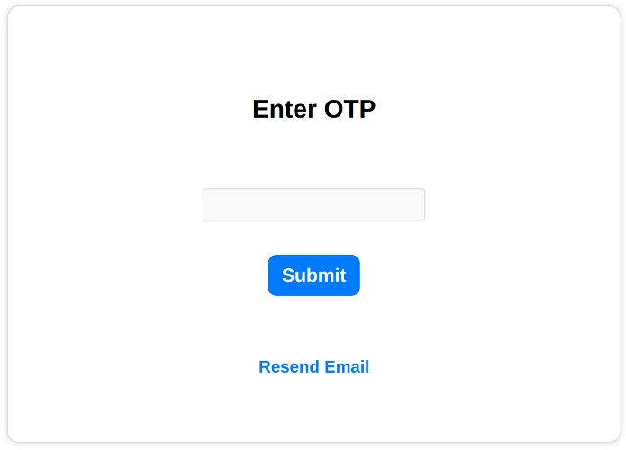

# SuperTokens EmailPassword and Social Login Demo app with Email Verification through OTP

This demo app demonstrates the following use cases:

-   Login with EmailPassword and Social Login
-   Email Verification with OTP
-   Logout
-   Forgot password flow
-   Session management

## Project setup

Clone the repo, enter the directory, and use `npm` to install the project dependencies:

```bash
git clone https://github.com/supertokens/supertokens-auth-react
cd supertokens-auth-react/examples/with-emailverification-with-otp
npm install
```

## Run the demo app

This compiles and serves the React app and starts the backend API server on port 3001.

```bash
npm run start
```

The app will start on `http://localhost:3000`

## Project structure & Parameters

-   The frontend code is located in the `src` folder.
-   The backend API is in the `api-server` folder.

## Node Mailer setup

We will be using node mailer to send the verification mails. You can use the `.env.example` file as a template and create a `.env` file which will contain your email credentials.

## Modifications for Email Verification with OTP:

You can take a look at our [quick setup](https://supertokens.com/docs/thirdpartyemailpassword/introduction) guide on how to setup EmailPassword and Social Login. Once setup we can now start making changes to our frontend and backend to enable the Email Verification with OTP flow.

### Frontend Changes:

Since Email Verification is enabled when a user signs up they will be redirected to a new screen which will prompt them to go to their email and click on the email verification link.

We will need to override the component which handles this flow to use our own custom component with UI to allow the user to enter an OTP. We can do so by overriding the `EmailVerificationSendVerifyEmail_Override` component in our frontend.

Our custom component will also have functions that will query our backend server's APIs to send the OTP email to the user and verify its email with the OTP.



### Backend Changes:

Our backend will need to handle two main things:

-   Generating the OTP and sending the email to the user
-   Checking that the OTP received for Email Verification is valid

#### Generating the OTP and sending the email to the user

In the regular email verification flow, the url which is sent to the user for verification contains a token. This token will be used for verifying the user.

We will use the `createAndSendCustomEmail` function in our backend config where we will generate an OTP, map it to the token and send the OTP to the user via email using node mailer.

#### Verifying the OTP

The `verifyEmailPOST` api handles email verification on the backend. We will need to override the default behavior and check that the OTP sent is mapped to a token. If a mapping exists we can retrieve the token and verify the users email, we will also remove the otp and token from the mapping; if no mapping exists we return an invalid token error.

## Future improvements

-   In our example app we are storing the OTP to token mapping in memory. Ideally you would store this mapping in a database for persistant storage.
-   Currently OTPs which havent been used will continue to remain in the mapping. An additional improvement could be to create a cronjob which would periodically remove old OTPs.

## Author

Created with :heart: by the folks at supertokens.com.

## License

This project is licensed under the Apache 2.0 license.
